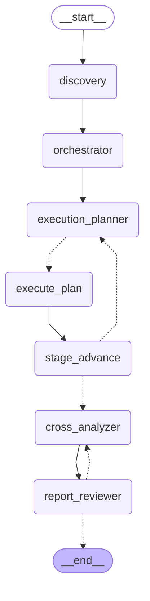
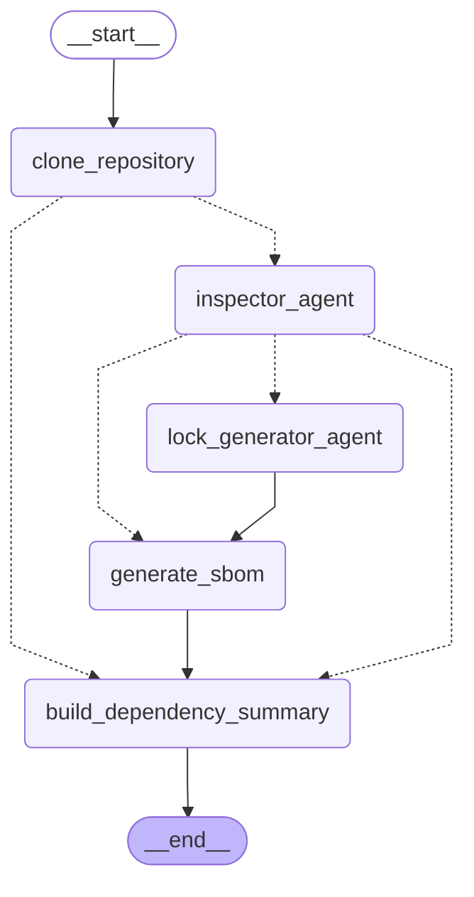

# Graph Architecture

See [architecture.md](architecture.md) for the high-level system overview and request lifecycle.

---

## Main graph structure

```mermaid
---
config:
  flowchart:
    curve: linear
---
graph TD;
        __start__([<p>__start__</p>]):::first
        discovery(discovery)
        orchestrator(orchestrator)
        execution_planner(execution_planner)
        execute_plan(execute_plan)
        stage_advance(stage_advance)
        cross_analyzer(cross_analyzer)
        report_reviewer(report_reviewer)
        __end__([<p>__end__</p>]):::last
        __start__ --> discovery;
        cross_analyzer --> report_reviewer;
        discovery --> orchestrator;
        execute_plan --> stage_advance;
        execution_planner -.-> execute_plan;
        orchestrator --> execution_planner;
        report_reviewer -.-> __end__;
        report_reviewer -.-> cross_analyzer;
        stage_advance -.-> cross_analyzer;
        stage_advance -.-> execution_planner;
        classDef default fill:#f2f0ff,line-height:1.2
        classDef first fill-opacity:0
        classDef last fill:#bfb6fc
```

---

### Discovery graph structure

```mermaid
---
config:
  flowchart:
    curve: linear
---
graph TD;
        __start__([<p>__start__</p>]):::first
        clone_repository(clone_repository)
        inspector_agent(inspector_agent)
        lock_generator_agent(lock_generator_agent)
        generate_sbom(generate_sbom)
        build_dependency_summary(build_dependency_summary)
        __end__([<p>__end__</p>]):::last
        __start__ --> clone_repository;
        clone_repository -.-> build_dependency_summary;
        clone_repository -.-> inspector_agent;
        generate_sbom --> build_dependency_summary;
        inspector_agent -.-> build_dependency_summary;
        inspector_agent -.-> generate_sbom;
        inspector_agent -.-> lock_generator_agent;
        lock_generator_agent --> generate_sbom;
        build_dependency_summary --> __end__;
        classDef default fill:#f2f0ff,line-height:1.2
        classDef first fill-opacity:0
        classDef last fill:#bfb6fc
```
