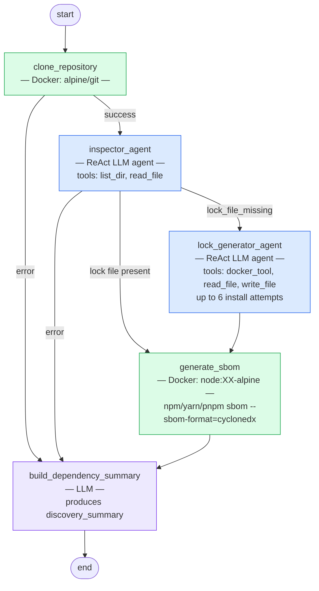
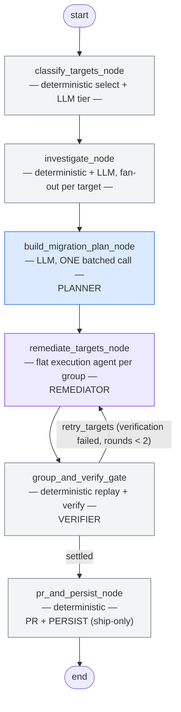

# Graph Architecture

See [architecture.md](architecture.md) for the high-level system overview and request lifecycle.

---

## Main graph

8-node cognitive investigation pipeline.

**HITL gates:**
- `investigation_planner` — graph pauses (`interrupt_before`) before the node, then `interrupt()` inside presents the proposed plan. Resumes on user approve / change / cancel.
- `finding_reviewer` — `interrupt()` fires whenever there are any findings. Auto-approves only when the correlator produces no findings at all.

**Fan-out / fan-in:**
`skill_dispatcher` returns a `list[Send]` — one per `(skill, dep, hypothesis)` assignment. LangGraph executes all `skill_executor` instances in parallel and reduces their `evidence` outputs via `operator.add` before `evidence_collector` runs.

**Re-correlation loop:**
`finding_reviewer` sends feedback back to `evidence_correlator` when quality criteria fail (up to 2 iterations). Criteria: high-severity findings must have ≥ 2 supporting evidence items, risk_score > 7 requires confidence ≥ 0.5, contradictions must be addressed in the summary.

---

## Discovery subgraph

Runs as a single node (`discovery`) inside the main graph.

**Output written to `MainState`:** `repo_path`, `project_metadata`, `manifest_files`, `detected_package_manager`, `docker_image`, `sbom_cyclonedx`, `sbom_result_id`, `discovery_summary`, `discovery_error`.

---

## Remediation subgraph

Runs as a single node (`remediation`) inside the main graph. 6-node pipeline: classify → investigate → plan → remediate → verify → PR/persist, with a deterministic correction loop between verify and remediate.

**Intended per-node responsibility** (target model — see mismatch note below):
planner *plans*, remediator *remediates*, verifier *verifies*, PR/persist node *only* opens the PR from the already-verified state and saves the result. When the verifier finds something broken, it sends the target back to the remediator with feedback.

### Node-by-node (as built)

- **`classify_targets_node`** (`classify.py`) — Two jobs today: (1) `select_remediation_targets` deterministically turns analysis findings into `RemediationTarget`s (dedup, direct-dep anchoring), (2) one LLM call per target classifies it into tier `r1`/`r2`/`r3` from its release notes (advisory hint only, doesn't gate anything downstream). Writes `targets`, resets `remediations`.

- **`investigate_node`** (`investigate.py`) — Fans out `investigate_target` over every target (bounded concurrency, semaphore=6). Per target: `dependents_of` (deterministic, from the dependency graph), `find_local_usage_sites` (deterministic, local grep-equivalent), and `investigate_release` (LLM digest of GitHub release notes between installed and target version → `ReleaseDigest`, with `migration_needed`/`migration_guide`/`breaking_changes`). Pure evidence-gathering, no decisions. Writes `investigations`.

- **`build_migration_plan_node`** (`plan.py`) — **The planner.** ONE batched structured-output LLM call covering *every* target at once (not per-target), so the model can reason about cross-target `requires` coupling in a single pass. Emits one `MigrationPlan` per target (bump / bump+codemod / replace, `requires` list). Writes `migration_plans`. Does not touch the repo, dispatch an agent, or verify anything.

- **`remediate_targets_node`** (`deepagent/nodes.py`) — **The remediator.** Groups targets into connected components via `connected_groups` (targets coupled by a plan's `requires` edge share a working copy). For each group, invokes ONE flat execution deepagent directly (never nested via `task()`) against a throwaway `copy_repo` clone, with tools to bump `package.json`, apply codemods, call `verify` (self-correction only — see below), and `commit_outcome`. On a retry round (`retry_targets` from the gate), re-dispatches only the failing groups with the prior verification failure log folded into the prompt so the agent can diagnose instead of repeating the same change. Writes `remediations` (provisional — `status` is the agent's own self-report), `requires_edges`, `migration_plans` (extended for any dep pulled in only via `requires`).

- **`group_and_verify_gate`** (`deepagent/nodes.py`) — **The verifier.** Deterministic, no LLM. Re-derives the same connected groups, and for each one replays the settled changes onto a *fresh* clean clone (`replay_and_verify_group`: `copy_repo` → `apply_group_changes` → `verify_working_copy` — install, build if scripted, test if scripted, re-audit) — never trusts the execution agent's self-reported status. Sets each member's real `status` (`fixed`/`failed`/`skipped`) and `required_by`. On failure with `correction_rounds < 2`, returns `retry_targets` and the graph routes back to `remediate_targets_node` — this is the feedback loop. Writes `remediations`, `retry_targets`, `correction_rounds`.

- **`pr_and_persist_node`** (`deepagent/nodes.py`) — Ship-only. Reads `verified_workdirs` (populated by `group_and_verify_gate`, one entry per member of a group it verified green AND kept because `consent` + a `git_pr` adapter were configured), groups deps by shared work dir, builds the PR title/body from the already-verified `Remediation` + `VerificationResult` data, opens the PR, and always persists the final `RemediationResult`. Does no install, no replay, no re-verification of its own.

### Resolved: `pr_and_persist_node` is now ship-only

Previously `pr_and_persist_node` re-derived groups, replayed changes onto a second working copy, and re-ran full install/build/test/audit verification independently of `group_and_verify_gate` -- a second, undocumented gate whose failures had no feedback path back to the remediator. As of `docs/superpowers/plans/2026-08-08-remediation-verify-pr-split.md`, `replay_and_verify_group` can keep its working copy on request (its install step already regenerates the lockfile against the bumped `package.json`), and `group_and_verify_gate` requests that only for groups it verifies green when a PR could actually be opened, recording the path in `verified_workdirs`. A verification failure on a kept copy is handled by the gate itself through the existing `retry_targets`/`correction_rounds` loop -- there is no second failure path anymore. `pr_and_persist_node` now only reads `verified_workdirs`, opens PRs, and persists.

### State fields (`RemediationState`)

`targets`, `investigations`, `migration_plans`, `remediations` — all keyed by `target_dep`, replace-on-write (`_merge_replace`) across correction rounds. `requires_edges` (target → companions it requires). `retry_targets` (deps to re-dispatch this round). `correction_rounds` (0..2, caps the verify↔remediate loop). `remediation_result_id` — set by `pr_and_persist_node` once persisted.
