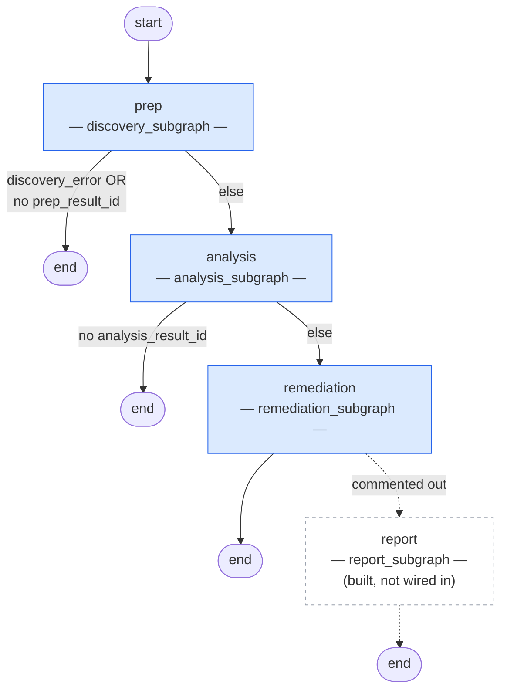
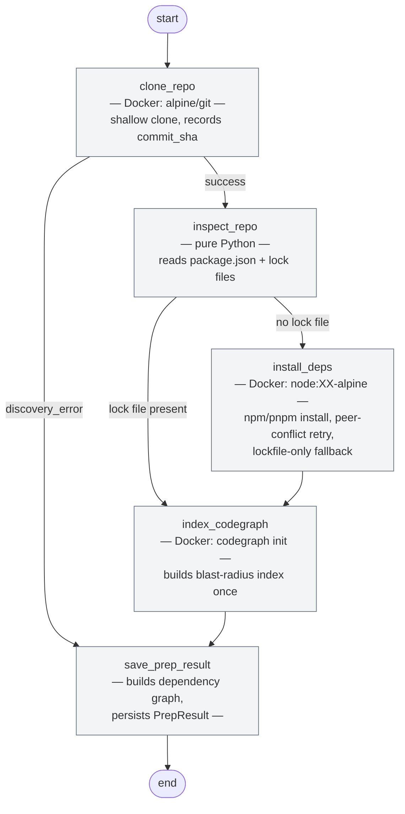
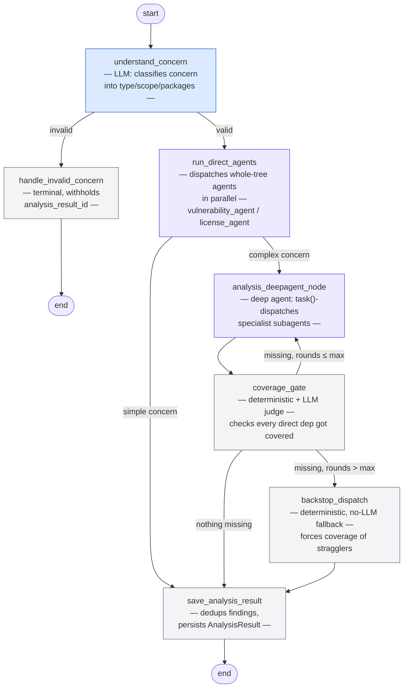
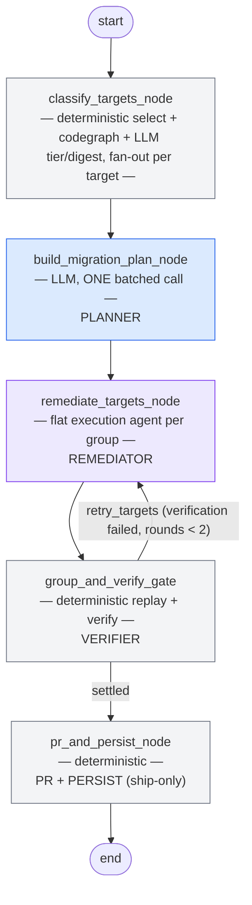

# Graph Architecture

See [architecture.md](architecture.md) for the high-level system overview and request lifecycle.

---

## Main graph

3-node top-level pipeline: `prep` → `analysis` → `remediation`, each a compiled subgraph. Either phase can short-circuit straight to `END` when it produced nothing for the next phase to build on.

**Routing:**
- `prep → END` — discovery failed (clone/install error) or otherwise never produced a `prep_result_id`.
- `analysis → END` — no `analysis_result_id`; includes the case where `understand_concern` classified the input as not a dependency-risk concern (`handle_invalid_concern` deliberately withholds it).
- `report` subgraph — implemented under `subgraphs/report/` but its `add_node`/`add_edge` calls are commented out in `build_main_graph()` ("not adding value on top of remediation output").

Source: `main_graph/graph.py`.

---

## Discovery subgraph

Runs as a single node (`prep`) inside the main graph. 5-node pipeline: clone → inspect → (install if no lock file) → index → save.

**Node-by-node:**
- **`clone_repo`** — shallow git clone via a throwaway `alpine/git` container; PAT auth (if any) is injected through a process-scoped header, never written to `.git/config`. Sets `discovery_error` on failure instead of raising.
- **`inspect_repo`** — no LLM, no Docker: parses `package.json` and whichever lock file is present to detect the package manager, its version, and picks a Node Docker image from `engines.node` (with a pnpm-11 minimum-Node bump).
- **`install_deps`** — only reached when no lock file was committed. Runs the install in the detected package manager's Docker image, retries with `--legacy-peer-deps` / `--force` on peer-conflict errors, and forces a lockfile-only fallback if the full install exits 0 without ever writing one.
- **`index_codegraph`** — builds the CodeGraph blast-radius index for the clone once; failure just leaves `codegraph_ready: False`, it doesn't fail the run.
- **`save_prep_result`** — no-ops if `discovery_error` is set. Otherwise builds the full dependency graph and persists `PrepResult`. A lock file generated this run (not committed) is registry-dependent, so its cache path is skipped for it.

Every node in this subgraph is deterministic — no LLM call anywhere in discovery.

**Output written to `MainState`:** `prep_result_id` (everything else discovery produces — package manager, docker image, dependency graph, manifests — lives on the persisted `PrepResult`, not on `MainState` directly).

Source: `subgraphs/discovery/graph.py`, `subgraphs/discovery/nodes/`.

---

## Analysis subgraph

Runs as a single node (`analysis`) inside the main graph. 7-node pipeline routing a concern either straight through (simple) or into a deep agent investigation wrapped in a deterministic coverage guarantee (complex).

**Simple vs. complex routing** (`concern.py::route_concern`): a concern is "simple" when its type is a subset of `{vulnerability, license}`, scope is `all_dependencies`, and it doesn't ask for a per-dependency breakdown. Simple concerns skip the deep agent entirely and go straight to `save_analysis_result` after the mandatory whole-tree scan.

### Node-by-node

- **`understand_concern`** (`nodes/understand_concern.py`) — one structured-output LLM call classifies the free-text concern into a `Concern` (type(s), scope, named packages, whether a per-dependency breakdown is required, `is_valid`). Routes to `handle_invalid_concern` when the input isn't a dependency-risk concern at all.

- **`handle_invalid_concern`** — terminal node; deliberately returns no `analysis_result_id` so `main_graph`'s `_after_analysis` routing skips remediation/report, and `job_runner`'s finalize logic still treats it as `done`, not `failed`. Writes the user-facing explanation as artifact data.

- **`run_direct_agents`** (`nodes/run_direct_agents.py`) — mandatory prefix step, runs unconditionally (even on the complex path). Dispatches whichever of `vulnerability_agent` / `license_agent` are relevant and in scope, in parallel — both are whole-tree, deterministic, non-LLM scanners (Trivy / SPDX rules), so a second dispatch (including from the deep agent) adds no coverage and is capped to one run per job.

- **`analysis_deepagent_node`** (`deepagent/nodes.py`) — the complex path. A deep agent whose system prompt carries the roster of specialist subagents, direct deps, and the concern; it `task()`-dispatches specialists as it sees fit. Re-invoked with a "still missing" nudge on each coverage-gate retry, picking up from its own prior `deepagent_state`.

- **`coverage_gate`** (`deepagent/coverage.py`) — deterministic bookkeeping: computes which direct deps still lack a package-scoped agent call. The one LLM call inside, `whole_tree_scan_satisfies_concern`, only fires when a whole-tree scan already succeeded, to judge whether that alone fully addresses the concern (skipping the rest of per-package coverage if so).

- **`backstop_dispatch`** (`deepagent/backstop.py`) — deterministic, no-LLM fallback once the correction-round budget is exhausted. Dispatches one agent call per still-missing direct dependency, reusing whichever package-scoped agent type was already in play (default `web_research_agent` if none were).

- **`save_analysis_result`** — dedups byte-identical findings (a re-dispatched whole-tree agent returns its full finding set again), filters by minimum severity, and persists `AnalysisResult`.

### State fields (`AnalysisState`)

`structured_concern` (the classified `Concern`). `deepagent_state` (last full state returned by the deep agent's `ainvoke`, carried across coverage-gate retries). `missing_deps`, `correction_rounds`, `whole_tree_checked_roster`, `whole_tree_satisfies_concern` — coverage-loop bookkeeping. `bundle_ids` and `agent_calls` (`Annotated[..., operator.add]`) accumulate across every agent dispatch, whether from `run_direct_agents`, the deep agent's subagents, or `backstop_dispatch`. `analysis_result_id` — set by `save_analysis_result` once persisted.

Source: `subgraphs/analysis/graph.py`, `subgraphs/analysis/concern.py`, `subgraphs/analysis/nodes/`, `subgraphs/analysis/deepagent/`.

---

## Remediation subgraph

Runs as a single node (`remediation`) inside the main graph. 5-node pipeline: classify → plan → remediate → verify → PR/persist, with a deterministic correction loop between verify and remediate.

**Intended per-node responsibility** (target model):
planner *plans*, remediator *remediates*, verifier *verifies*, PR/persist node *only* opens the PR from the already-verified state and saves the result. When the verifier finds something broken, it sends the target back to the remediator with feedback.

### Node-by-node (as built)

- **`classify_targets_node`** (`classify.py`) — `select_remediation_targets` deterministically turns analysis findings into `RemediationTarget`s (dedup, direct-dep anchoring), resolves each target's registry version + GitHub repo in one `npm view` call, then fans out `classify_target` over every target (bounded concurrency, semaphore=6). Per target: `dependents_of` (deterministic, from the dependency graph), a codegraph `blast_radius` call for real call sites, a deterministic no-upgrade check (registry publishes nothing above the declared range → tier `r3`, no fetch, no LLM), and otherwise ONE LLM call over the release notes windowed to the target version that produces both the tier (`r1`/`r2`/`r3`, advisory hint only downstream) and a migration digest (`migration_needed`/`migration_guide`/`breaking_changes`) grounded in the dependents/call-sites already gathered. Writes `targets` and `investigations`, resets `remediations`.

- **`build_migration_plan_node`** (`plan.py`) — **The planner.** ONE batched structured-output LLM call covering *every* target at once (not per-target), so the model can reason about cross-target `requires` coupling in a single pass. Emits one `MigrationPlan` per target (bump / bump+codemod / replace, `requires` list). Writes `migration_plans`. Does not touch the repo, dispatch an agent, or verify anything.

- **`remediate_targets_node`** (`deepagent/nodes.py`) — **The remediator.** Groups targets into connected components via `connected_groups` (targets coupled by a plan's `requires` edge share a working copy). For each group, invokes ONE flat execution deepagent directly (never nested via `task()`) against a throwaway `copy_repo` clone, with tools to bump `package.json`, apply codemods, call `verify` (self-correction only — see below), and `commit_outcome`. On a retry round (`retry_targets` from the gate), re-dispatches only the failing groups with the prior verification failure log folded into the prompt so the agent can diagnose instead of repeating the same change. Writes `remediations` (provisional — `status` is the agent's own self-report), `requires_edges`, `migration_plans` (extended for any dep pulled in only via `requires`).

- **`group_and_verify_gate`** (`deepagent/nodes.py`) — **The verifier.** Deterministic, no LLM. Re-derives the same connected groups, and for each one replays the settled changes onto a *fresh* clean clone (`replay_and_verify_group`: `copy_repo` → `apply_group_changes` → `verify_working_copy` — install, build if scripted, test if scripted, re-audit) — never trusts the execution agent's self-reported status. Sets each member's real `status` (`fixed`/`failed`/`skipped`) and `required_by`. On failure with `correction_rounds < 2`, returns `retry_targets` and the graph routes back to `remediate_targets_node` — this is the feedback loop. Writes `remediations`, `retry_targets`, `correction_rounds`, `verified_workdirs`.

- **`pr_and_persist_node`** (`deepagent/nodes.py`) — Ship-only. Reads `verified_workdirs` (populated by `group_and_verify_gate`, one entry per member of a group it verified green AND kept because `consent` + a `git_pr` adapter were configured), groups deps by shared work dir, builds the PR title/body from the already-verified `Remediation` + `VerificationResult` data, opens the PR, and always persists the final `RemediationResult`. Does no install, no replay, no re-verification of its own.

### Resolved: `pr_and_persist_node` is now ship-only

Previously `pr_and_persist_node` re-derived groups, replayed changes onto a second working copy, and re-ran full install/build/test/audit verification independently of `group_and_verify_gate` -- a second, undocumented gate whose failures had no feedback path back to the remediator. As of `docs/superpowers/plans/2026-08-08-remediation-verify-pr-split.md`, `replay_and_verify_group` can keep its working copy on request (its install step already regenerates the lockfile against the bumped `package.json`), and `group_and_verify_gate` requests that only for groups it verifies green when a PR could actually be opened, recording the path in `verified_workdirs`. A verification failure on a kept copy is handled by the gate itself through the existing `retry_targets`/`correction_rounds` loop -- there is no second failure path anymore. `pr_and_persist_node` now only reads `verified_workdirs`, opens PRs, and persists.

### State fields (`RemediationState`)

`targets`, `investigations`, `migration_plans`, `remediations` — all keyed by `target_dep`, replace-on-write (`_merge_replace`) across correction rounds. `requires_edges` (target → companions it requires). `retry_targets` (deps to re-dispatch this round). `correction_rounds` (0..2, caps the verify↔remediate loop). `verified_workdirs` (`target_dep` → `work_dir`, populated by the gate for a group it verifies green and keeps because a PR could actually be opened; every member of a group maps to the same path). `remediation_result_id` — set by `pr_and_persist_node` once persisted.

A kept work dir is owned by whichever node currently holds it — the gate until it hands off, then `pr_and_persist_node` until it ships or discards it. An unhandled exception or a cancelled job in the window between the gate keeping a copy and `pr_and_persist_node` running can therefore leave that copy behind under the project's `tmp/` directory, since nothing else sweeps it. This is a known, accepted tradeoff of handing a verified copy directly to the PR step.
