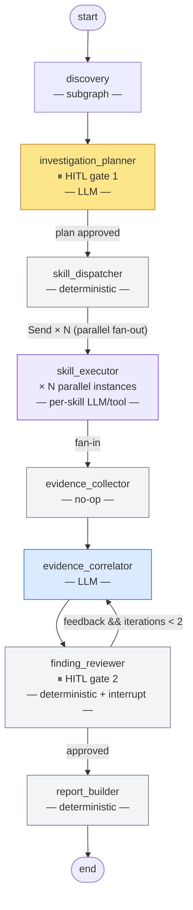

# Graph Architecture

See [architecture.md](architecture.md) for the high-level system overview and request lifecycle.

---

## Main graph

8-node cognitive investigation pipeline.

**HITL gates:**
- `investigation_planner` — graph pauses (`interrupt_before`) before the node, then `interrupt()` inside presents the proposed plan. Resumes on user approve / change / cancel.
- `finding_reviewer` — `interrupt()` fires whenever there are any findings. Auto-approves only when the correlator produces no findings at all.

**Fan-out / fan-in:**
`skill_dispatcher` returns a `list[Send]` — one per `(skill, dep, hypothesis)` assignment. LangGraph executes all `skill_executor` instances in parallel and reduces their `evidence` outputs via `operator.add` before `evidence_collector` runs.

**Re-correlation loop:**
`finding_reviewer` sends feedback back to `evidence_correlator` when quality criteria fail (up to 2 iterations). Criteria: high-severity findings must have ≥ 2 supporting evidence items, risk_score > 7 requires confidence ≥ 0.5, contradictions must be addressed in the summary.

---

## Discovery subgraph

Runs as a single node (`discovery`) inside the main graph.

**Output written to `MainState`:** `repo_path`, `project_metadata`, `manifest_files`, `detected_package_manager`, `docker_image`, `sbom_cyclonedx`, `sbom_result_id`, `discovery_summary`, `discovery_error`.
